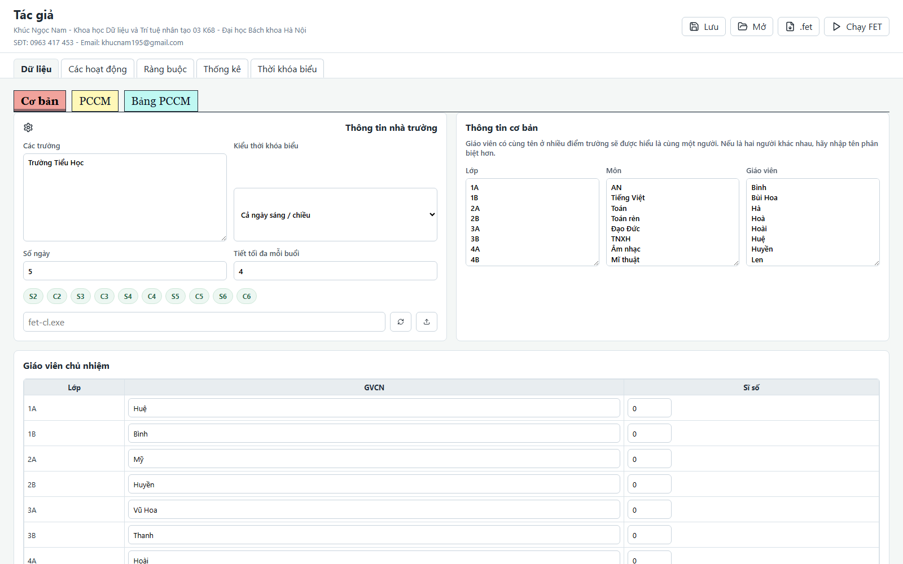

# TKB Tiểu học

Ứng dụng desktop hỗ trợ xây dựng thời khóa biểu tiểu học bằng React, Electron và FET 7.9.4. Ứng dụng phù hợp với mô hình có một hoặc nhiều trường/điểm trường, nhiều lớp và giáo viên có thể di chuyển giữa các điểm trường.

## 1. Tổng quan giao diện

Giao diện được chia thành 5 tab chính:

1. **Dữ liệu**: khai báo trường, lớp, môn, giáo viên, giáo viên chủ nhiệm và phân công chuyên môn.
2. **Các hoạt động**: kiểm tra số tiết/tuần của từng môn ở từng lớp.
3. **Ràng buộc**: mô tả những điều kiện FET phải tôn trọng hoặc nên ưu tiên.
4. **Thống kê**: kiểm tra tổng số tiết theo giáo viên và theo lớp.
5. **Thời khóa biểu**: xem kết quả sau khi FET xếp xong và xuất ra Excel/PNG.



Thanh công cụ phía trên có 4 thao tác:

- **Lưu**: lưu toàn bộ dự án thành file JSON.
- **Mở**: mở lại file JSON đã lưu.
- **.fet**: xuất dữ liệu hiện tại thành file đầu vào cho FET.
- **Chạy FET**: xuất dữ liệu tạm, gọi `fet-cl.exe` và nạp kết quả vào ứng dụng.

## 2. Cài đặt và khởi động

### Dùng bản đã đóng gói

Trên Windows, chạy file cài đặt hoặc bản portable trong thư mục `release` nếu bạn đã build ứng dụng. Không cần chạy Vite khi dùng bản đóng gói.

### Chạy từ mã nguồn

Cài Node.js rồi mở PowerShell tại thư mục dự án:

```powershell
npm install
npm run desktop
```

Lệnh này khởi động máy chủ Vite và cửa sổ Electron. Nếu chỉ muốn xem giao diện trên trình duyệt:

```powershell
npm run dev
```

Lưu ý: bản trình duyệt có thể nhập và xuất `.fet`, nhưng các chức năng gọi trực tiếp FET, xuất Excel theo thư mục và một số hộp thoại file chỉ hoạt động trong bản desktop Electron.

## 3. Chuẩn bị FET

Ứng dụng cần chương trình dòng lệnh `fet-cl.exe` để tự động xếp thời khóa biểu.

1. Khi chạy từ mã nguồn, ưu tiên dùng file:
   `vendor/fet/fet-cl.exe`.
2. Trong tab **Dữ liệu**, nhìn xuống ô đường dẫn FET.
3. Bấm nút tìm tự động hoặc nút chọn file và chọn đúng `fet-cl.exe`.
4. Nếu dùng đường dẫn khác, có thể đặt biến môi trường `FET_CL_PATH` trỏ tới file này.

Khi bấm **Chạy FET**, ứng dụng tạo file đầu vào tạm, chạy FET với giới hạn thời gian mặc định 300 giây, yêu cầu FET sinh `activities.xml`, rồi đọc kết quả để hiển thị trên tab **Thời khóa biểu**.

## 4. Quy trình tạo thời khóa biểu

Nên thực hiện theo thứ tự sau để hạn chế lỗi dữ liệu.

### Bước 1: Khai báo dữ liệu cơ bản

Vào **Dữ liệu → Cơ bản**.

Ở khung **Thông tin nhà trường**:

- Nhập tên các trường/điểm trường, mỗi dòng một tên.
- Chọn kiểu thời khóa biểu:
  - **Theo ngày / một buổi**: mỗi ngày được xem như một phiên học.
  - **Cả ngày sáng / chiều**: mỗi ngày có các phiên sáng và chiều.
- Nhập **Số ngày** trong tuần.
- Nhập **Tiết tối đa mỗi buổi**.

Các nút `S2`, `C2`, `S3`, `C3`... bên dưới là các phiên/ngày mà FET sẽ sử dụng. Khi thay đổi số ngày hoặc số tiết, hãy kiểm tra lại cách chia buổi trước khi nhập ràng buộc.

Ở khung **Thông tin cơ bản**:

- Nhập danh sách **Lớp**, mỗi dòng một lớp.
- Nhập danh sách **Môn**, mỗi dòng một môn.
- Nhập danh sách **Giáo viên**, mỗi dòng một giáo viên.
- Nếu có nhiều điểm trường, chọn đúng nút điểm trường trước khi nhập lớp và giáo viên thuộc điểm trường đó.

Phần **Giáo viên chủ nhiệm** cho phép chọn GVCN và nhập sĩ số của từng lớp. Thông tin này được lưu trong dự án và dùng cho việc quản lý dữ liệu; không tự thay thế phân công chuyên môn.

### Bước 2: Nhập phân công chuyên môn (PCCM)

Vào **Dữ liệu → PCCM**.

1. Chọn điểm trường.
2. Chọn lớp.
3. Mỗi dòng tương ứng với một môn được dạy ở lớp đó.
4. Chọn giáo viên phụ trách.
5. Nhập số tiết/tuần.
6. Nếu môn có nhiều tiết liên tiếp hoặc cần chia theo mẫu cụ thể, thiết lập mẫu chia tiết theo các trường có sẵn.
7. Dùng nút thêm môn để bổ sung dòng mới; xóa những dòng không dùng.

Sau khi nhập xong, mở **Bảng PCCM** để kiểm tra nhanh toàn bộ lớp, môn, giáo viên và số tiết. Nếu có lỗi, quay lại tab **PCCM** để sửa thay vì sửa trực tiếp ở bảng kiểm tra.

### Bước 3: Kiểm tra các hoạt động

Vào tab **Các hoạt động**.

Chọn điểm trường và lớp để xem danh sách hoạt động. Kiểm tra tối thiểu:

- Mỗi môn có đúng giáo viên.
- Số tiết/tuần đúng với kế hoạch dạy học.
- Các môn cần học liền tiết đã được chia đúng.
- Không có hoạt động bị bỏ trống giáo viên hoặc số tiết.

Bấm **Tô màu** nếu muốn ứng dụng tự gán màu cho các môn khi xem thời khóa biểu.

### Bước 4: Thiết lập ràng buộc

Vào tab **Ràng buộc**. Chỉ nên thêm các ràng buộc thật sự cần thiết; quá nhiều điều kiện cứng có thể làm FET không tìm được nghiệm.

#### Ràng buộc cơ bản

Dùng để giới hạn số tiết trống tối đa của giáo viên hoặc lớp trong một buổi. Bật checkbox rồi nhập giá trị phù hợp.

#### Thời gian bận của giáo viên

Dùng khi giáo viên không thể dạy ở một phiên/ngày nhất định. Chọn giáo viên, chọn thời gian và thêm ràng buộc.

#### Thời gian ưu tiên

Dùng cho những tiết nên hoặc bắt buộc nằm tại một ngày/tiết cụ thể, ví dụ chào cờ hoặc sinh hoạt. Trọng số càng cao thì FET càng ưu tiên giữ điều kiện; trọng số 1 thường dùng cho điều kiện bắt buộc.

#### Số buổi đi của giáo viên

Dùng để đặt số buổi tối thiểu/tối đa trong tuần hoặc kiểm soát việc giáo viên phải di chuyển giữa các điểm trường.

### Bước 5: Kiểm tra thống kê

Vào **Thống kê** trước khi chạy FET:

- **Tổng số tiết dạy của giáo viên**: phát hiện giáo viên bị phân công quá nhiều hoặc chưa đủ tiết.
- **Thống kê theo lớp**: kiểm tra tổng số tiết của từng lớp.

Nếu tổng tiết không hợp lý, quay lại PCCM và sửa dữ liệu trước khi chạy FET.

### Bước 6: Chạy FET

1. Bấm **Lưu** để tạo một bản sao JSON trước khi chạy.
2. Bấm **.fet** nếu muốn giữ lại file đầu vào FET.
3. Bấm **Chạy FET**.
4. Chờ đến khi trạng thái hoàn tất.
5. Đọc các phần kết quả, cảnh báo và lỗi hiển thị ở đầu màn hình.

Nếu FET không tìm được nghiệm, hãy giảm các ràng buộc bắt buộc, kiểm tra giáo viên bận và kiểm tra các môn có số tiết vượt quá số phiên khả dụng.

### Bước 7: Xem và xuất kết quả

Vào **Thời khóa biểu** sau khi FET chạy thành công.

- Chọn chế độ xem theo **lớp** hoặc **giáo viên**.
- Chọn điểm trường và đối tượng cần xem.
- Bấm **Tải kết quả** nếu muốn nạp thủ công file `*_activities.xml` từ FET.
- Bấm **Xuất Excel** để tạo các bảng Excel.
- Bấm nút xuất ảnh để lưu bảng đang xem thành PNG.

Khi dùng FET bên ngoài ứng dụng, hãy chọn file `*_activities.xml` trong thư mục output của FET, không chọn `result.txt`, `warnings.txt` hoặc file `.fet` đầu vào.

## 5. Lưu và mở dự án

- Dữ liệu được lưu tạm trong local storage của ứng dụng khi đang nhập.
- Nên bấm **Lưu** thường xuyên để tạo file JSON có thể sao lưu hoặc gửi sang máy khác.
- Dùng **Mở** để khôi phục dự án JSON.
- Sau khi thay đổi số ngày, số tiết hoặc danh sách lớp, nên lưu lại dự án và chạy lại FET.

## 6. Xử lý lỗi thường gặp

### Không tìm thấy `fet-cl.exe`

Kiểm tra file `vendor/fet/fet-cl.exe`, sau đó chọn thủ công trong tab **Dữ liệu**. Nếu chạy bản đóng gói, kiểm tra thư mục tài nguyên của ứng dụng hoặc đặt `FET_CL_PATH`.

### Nút Chạy FET bị vô hiệu hóa

Thường là do dữ liệu đang có lỗi. Đọc bảng cảnh báo/lỗi ở đầu giao diện và sửa các trường còn thiếu trong Dữ liệu, PCCM hoặc Các hoạt động.

### FET chạy nhưng không có thời khóa biểu

Kiểm tra log lỗi/cảnh báo và bảo đảm FET đã sinh file `*_activities.xml`. Nếu chạy FET ngoài ứng dụng, tải đúng file này ở tab **Thời khóa biểu**.

### Không xuất được Excel

Chức năng xuất Excel theo thư mục cần bản desktop Electron. Nếu đang mở bằng trình duyệt, hãy chạy `npm run desktop` hoặc dùng bản portable/cài đặt Windows.

### Kết quả có nhiều tiết trống hoặc giáo viên bị dồn tiết

Kiểm tra lại số ngày, số tiết mỗi buổi, số tiết/tuần và các ràng buộc gap. Nên nới các điều kiện ưu tiên trước khi thay đổi điều kiện bắt buộc.

## 7. Lệnh dành cho developer

```powershell
npm run dev       # Chạy Vite trên trình duyệt
npm run desktop   # Chạy Vite cùng Electron
npm run typecheck # Kiểm tra TypeScript
npm test          # Chạy unit test
npm run build     # Kiểm tra và build giao diện production
npm run dist:win  # Đóng gói Windows: NSIS và portable
```

## 8. Cấu trúc thư mục

```text
src/       Giao diện React và logic tạo dữ liệu FET
electron/  Main process, preload và tích hợp FET/Excel
tests/     Unit test
vendor/    Runtime FET và thư viện đi kèm
docs/      Tài liệu và ảnh minh họa
```

## Lưu ý bản quyền

Ứng dụng sử dụng FET làm bộ máy xếp thời khóa biểu. Các file runtime và giấy phép đi kèm nằm trong thư mục `vendor/fet`.

